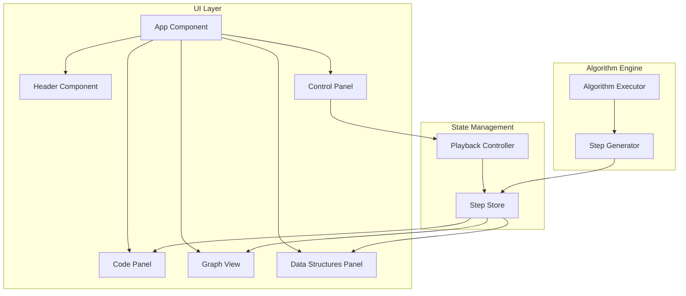

# Design Document

## Overview

本项目是一个基于 TypeScript + React + D3.js 的算法可视化演示工具，用于展示 LeetCode 207 课程表问题的拓扑排序算法。系统采用单页应用架构，将算法执行过程分解为离散的步骤，每个步骤包含代码执行位置、变量状态和图形状态的快照。

## Architecture

系统采用组件化架构，主要分为以下层次：



## Components and Interfaces

### 1. App Component
根组件，负责整体布局和状态管理。

```typescript
interface AppProps {}

interface AppState {
  currentStepIndex: number;
  isPlaying: boolean;
  steps: AlgorithmStep[];
}
```

### 2. Header Component
页面头部，包含标题和 GitHub 链接。

```typescript
interface HeaderProps {
  title: string;
  leetcodeUrl: string;
  githubUrl: string;
}
```

### 3. Code Panel Component
代码展示面板，支持语法高亮和变量值显示。

```typescript
interface CodePanelProps {
  code: string;
  highlightedLine: number;
  variables: VariableState[];
}

interface VariableState {
  name: string;
  value: string;
  line: number;
}
```

### 4. Graph View Component
D3.js 图形可视化组件。

```typescript
interface GraphViewProps {
  nodes: GraphNode[];
  edges: GraphEdge[];
  nodeStates: Map<number, NodeState>;
  activeEdge: GraphEdge | null;
}

interface GraphNode {
  id: number;
  x?: number;
  y?: number;
}

interface GraphEdge {
  source: number;
  target: number;
}

type NodeState = 'unvisited' | 'in-queue' | 'completed';
```

### 5. Data Structures Panel Component
数据结构可视化面板。

```typescript
interface DataStructuresPanelProps {
  inDegree: number[];
  queue: number[];
  learnCount: number;
  highlightedIndex: number | null;
}
```

### 6. Control Panel Component
播放控制面板。

```typescript
interface ControlPanelProps {
  isPlaying: boolean;
  canGoPrevious: boolean;
  canGoNext: boolean;
  currentStep: number;
  totalSteps: number;
  onPlay: () => void;
  onPause: () => void;
  onPrevious: () => void;
  onNext: () => void;
}
```

### 7. Algorithm Step Interface
算法步骤数据结构。

```typescript
interface AlgorithmStep {
  id: number;
  description: string;
  highlightedLine: number;
  variables: VariableState[];
  nodeStates: Map<number, NodeState>;
  activeEdge: GraphEdge | null;
  inDegree: number[];
  queue: number[];
  learnCount: number;
}
```

### 8. Step Generator
步骤生成器，将算法执行过程转换为步骤序列。

```typescript
interface StepGeneratorInput {
  numCourses: number;
  prerequisites: number[][];
}

function generateSteps(input: StepGeneratorInput): AlgorithmStep[];
```

## Data Models

### Algorithm Input
```typescript
interface AlgorithmInput {
  numCourses: number;
  prerequisites: [number, number][];
}
```

### Graph Data
```typescript
interface GraphData {
  nodes: GraphNode[];
  edges: GraphEdge[];
  adjacencyList: Map<number, number[]>;
}
```

### Playback State
```typescript
interface PlaybackState {
  currentStepIndex: number;
  isPlaying: boolean;
  playbackSpeed: number;
}
```


## Correctness Properties

*A property is a characteristic or behavior that should hold true across all valid executions of a system-essentially, a formal statement about what the system should do. Properties serve as the bridge between human-readable specifications and machine-verifiable correctness guarantees.*

Based on the prework analysis, the following correctness properties have been identified:

### Property 1: Step-Line Correspondence
*For any* algorithm step in the step sequence, the highlighted line number in the code panel SHALL match the execution point defined in that step's data.
**Validates: Requirements 2.2, 2.5**

### Property 2: Variable Display Consistency
*For any* algorithm step with variable state changes, all variables defined in that step SHALL be displayed with their correct values at their corresponding line numbers.
**Validates: Requirements 2.3**

### Property 3: Step Navigation Correctness
*For any* current step index N where 0 < N < totalSteps, invoking the previous action SHALL result in step index N-1, and for any step index N where 0 <= N < totalSteps-1, invoking the next action SHALL result in step index N+1.
**Validates: Requirements 3.3, 3.4, 4.1, 4.2**

### Property 4: Play/Pause Toggle
*For any* playback state (playing or paused), invoking the toggle action SHALL result in the opposite state.
**Validates: Requirements 4.3**

### Property 5: Graph Structure Correctness
*For any* algorithm input with numCourses courses and prerequisites array, the generated graph SHALL contain exactly numCourses nodes and exactly prerequisites.length directed edges with correct source-target relationships.
**Validates: Requirements 5.1, 5.2**

### Property 6: Step State Consistency
*For any* algorithm step, the node states in the graph view and the data structure values (inDegree array, queue, learnCount) SHALL accurately reflect the algorithm's state at that execution point.
**Validates: Requirements 5.3, 6.4**

### Property 7: Initial In-Degree Correctness
*For any* algorithm input, the initial in-degree array SHALL correctly count the number of incoming edges for each course node.
**Validates: Requirements 6.1**

### Property 8: Algorithm Result Correctness
*For any* algorithm input, the final learnCount value SHALL equal numCourses if and only if the course schedule is completable (no cycles exist in the dependency graph).
**Validates: Requirements 6.5**

## Error Handling

### User Input Errors
- Invalid step navigation (beyond bounds) SHALL be silently ignored
- Keyboard events SHALL be debounced to prevent rapid-fire navigation

### Rendering Errors
- D3.js rendering failures SHALL display a fallback error message
- Code highlighting failures SHALL display unhighlighted code as fallback

### Data Errors
- Invalid algorithm input SHALL display an error message to the user
- Step generation failures SHALL be caught and reported

## Testing Strategy

### Unit Testing
使用 Vitest 作为测试框架进行单元测试：

1. **Component Tests**: 测试各个 React 组件的渲染和交互
2. **Step Generator Tests**: 测试算法步骤生成的正确性
3. **Utility Function Tests**: 测试工具函数的边界情况

### Property-Based Testing
使用 fast-check 库进行属性测试：

1. **Step Navigation Property**: 验证步骤导航的正确性
2. **Graph Structure Property**: 验证图结构生成的正确性
3. **Algorithm Result Property**: 验证算法结果的正确性
4. **State Consistency Property**: 验证状态一致性

每个属性测试将运行至少 100 次迭代。

测试文件命名规范：
- 单元测试: `*.test.ts` 或 `*.test.tsx`
- 属性测试: `*.property.test.ts`

每个属性测试必须使用以下格式标注：
`**Feature: course-schedule-visualizer, Property {number}: {property_text}**`

## Technology Stack

- **Framework**: React 18 with TypeScript
- **Build Tool**: Vite
- **Visualization**: D3.js v7
- **Syntax Highlighting**: Prism.js or highlight.js
- **Testing**: Vitest + fast-check
- **Styling**: CSS Modules or Tailwind CSS
- **Deployment**: GitHub Pages via GitHub Actions

## File Structure

```
src/
├── components/
│   ├── App.tsx
│   ├── Header.tsx
│   ├── CodePanel.tsx
│   ├── GraphView.tsx
│   ├── DataStructuresPanel.tsx
│   └── ControlPanel.tsx
├── hooks/
│   ├── usePlayback.ts
│   └── useKeyboardShortcuts.ts
├── algorithm/
│   ├── stepGenerator.ts
│   └── types.ts
├── data/
│   └── algorithmCode.ts
├── styles/
│   └── *.css
├── main.tsx
└── index.html
```
